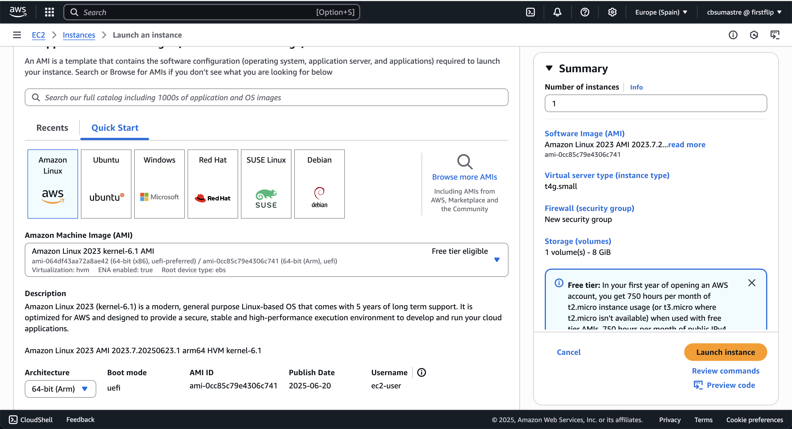
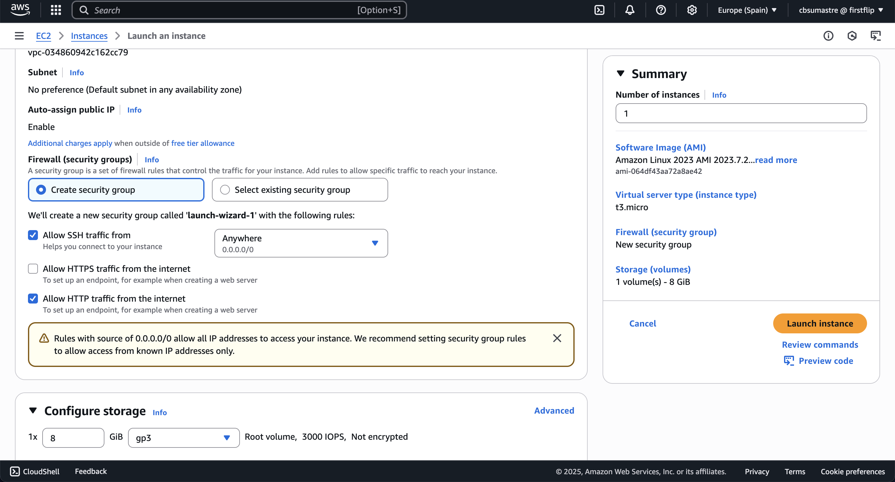
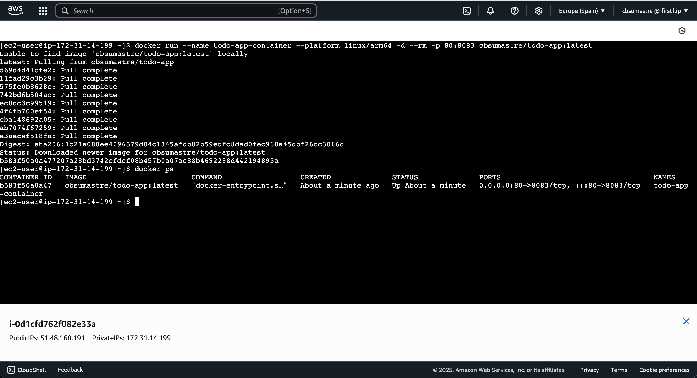

# Master Front End XVII - Módulo 7 - Cloud - Laboratorio

## Modulo Cloud - Laboratorio

### Opcional

Desplegar la app en AWS y la imagen de Docker en Docker Hub.

### Para poder desplegar en AWS + Docker Hub:

- Construir la imagen docker

```bash
 docker build -t todo-app:latest .
```

- Tagear la imagen docker a una nueva (para que sea compatible con Docker Hub)

```bash
docker tag todo-app:latest cbsumastre/todo-app:latest
```

- Hacer login en Docker Hub

```bash
docker login
```

- Subir la imagen a Docker Hub

```bash
docker push cbsumastre/todo-app:latest
```

- Crear un máquina (EC2) en AWS
  
  

- Conectar con la consola de AWS para instalar docker

```bash
sudo yum update -y
sudo yum install docker
sudo service docker start
sudo usermod -a -G docker ec2-user

```

- Crear contenedor usando la imagen publicada en Docker Hub

```bash
docker run --name todo-app-container --platform linux/arm64 -d --rm -p 80:8083 cbsumastre/todo-app:latest
```



- Aplicación desplegada en AWS usando imagen de Docker Hub:
  [http://ec2-51-48-160-191.eu-south-2.compute.amazonaws.com/](http://ec2-51-48-160-191.eu-south-2.compute.amazonaws.com/)
